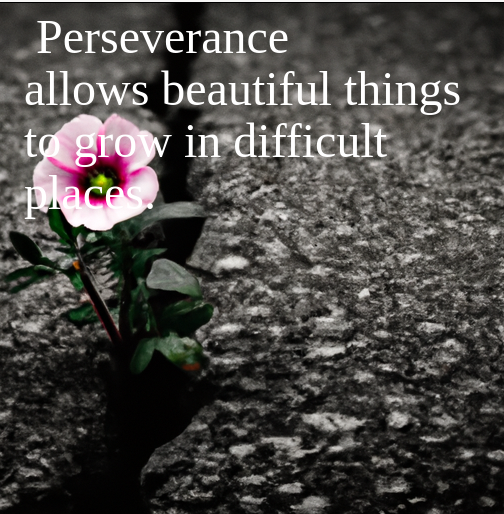

# meme_motivation_image

Create a generated image using OpenAI Dalle 2 or 3, and then write a motivating message on the image!

There are two versions of meme motivation, a manual and auatomtic version. 
1. Using the manual version, one can use their own motivational image or generate an image, and then they can write their own motivational messsage on the image.
2. Using the automatic version, one simply pushs the button and a motivational image and text are created using prompts on the topics of [health, education, life-balance, happiness, success]. One of the five topics are randomly choosen and both an image and text are generated to create a unique motivational image based on chance for each user.

## Manual Meme Motivation 
[Try Manual Meme Motivation] https://codesolutions2.github.io/meme_motivation_image/index3.html

Manual Meme Motivation Examples:

## Automatic Meme Motivation 
[Best working version] https://codesolutions2.github.io/meme_motivation_image/automatic_index.html
